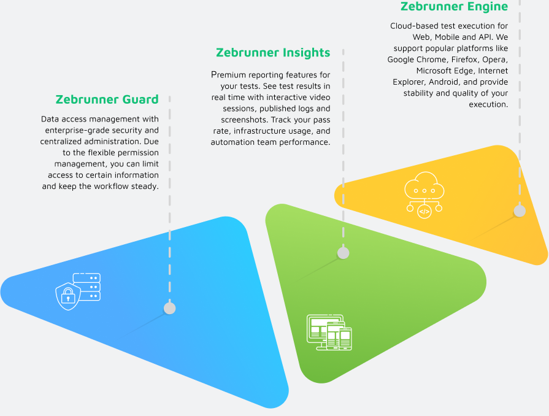

## Zebrunner is

Zebrunner is all-in-one automation testing platform with embedded reporting and real-time analytics. Get insights on your testing results with AI analytics dashboards. Benefit from enterprise-grade scalability for test execution. Make debugging faster with automatic issue reporting.

Lorem ipsum dolor sit amet, consectetur adipiscing elit. Varius ullamcorper laoreet vitae gravida quis et turpis porttitor. In habitasse enim morbi mauris cras.

|  What's new  |
| --- |
|Get insights on your testing results with AI analytics dashboards. Benefit from enterprise-grade scalability for test execution. Make debugging faster with automatic issue reporting. |

|  FAQ |
| --- |
| Get insights on your testing results with AI analytics dashboards. Benefit from enterprise-grade scalability for test execution. Make debugging faster with automatic issue reporting. |

|  Agents |
| --- |
| Official Zebrunner TestNG agent providing reporting and smart reruns functionality. In order to enable Zebrunner Listener for TestNG no special configuration is required. |
| [TestNg](testNg/README.md)  [JUnit]()  [JUnit 5]()|

|  User guide |
| --- |
| Get insights on your testing results with AI analytics dashboards. Benefit from enterprise-grade scalability for test execution. Make debugging faster with automatic issue reporting. |

|  Integrations |
| --- |
| Zebrunner team with help of open-source community implements reporting agents for the most popular languages and frameworks like TestNG, NUnit, RSpec, Jest and others. We are open to support your framework, just let us know. |
| [Jenkins]()  [LDAP]()  [Slack]()  [Microsoft team]()  [TestRail]()  [Qtest]()  [Jira]()  [Selenium]()  [ZEBRUNNER insights]()  [BROWSERSTACK]()  [MCLOUD]()  [LAMBDATEST]()  [SAUCELABS]()|
