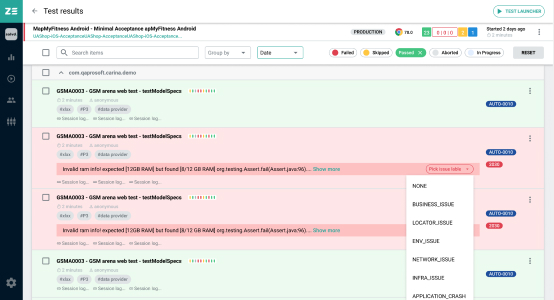

## Release Notes

> Version 1.16.X 
>
> Last update: Sep 14, 2020

| 1.16 | Sep 14, 2020 |
| ---- | ------------ |
| Improvement |  Lorem ipsum dolor sit amet, consectetur adipiscing elit ut aliquam, purus |
| Compatibility |  Lorem ipsum dolor sit amet, consectetur adipiscing elit ut aliquam, purus |
| |  Lorem ipsum dolor sit amet, consectetur adipiscing elit. Commodo mi quis velit, adipiscing aliquet id in accumsan. Curabitur facilisi purus commodo scelerisque purus aliquam posuere.|
| |  |
| Fix |  Lorem ipsum dolor sit amet, consectetur adipiscing elit ut aliquam, purus
| |  Lorem ipsum dolor sit amet, consectetur adipiscing elit. Commodo mi quis velit, adipiscing aliquet id in accumsan. Curabitur facilisi purus commodo scelerisque purus aliquam posuere.
| |  Lorem ipsum dolor sit amet, consectetur adipiscing elit. Commodo mi quis velit, adipiscing aliquet id in accumsan. Curabitur facilisi purus commodo scelerisque purus aliquam posuere.

| 1.14 | Sep 02, 2020 |
| ---- | ------------ |
| Improvement |  Lorem ipsum dolor sit amet, consectetur adipiscing elit ut aliquam, purus |
| Fix |  Lorem ipsum dolor sit amet, consectetur adipiscing elit ut aliquam, purus |
| |  Lorem ipsum dolor sit amet, consectetur adipiscing elit. Commodo mi quis velit, adipiscing aliquet id in accumsan. Curabitur facilisi purus commodo scelerisque purus aliquam posuere.

> Version 1.10.X 
>
> Last update: Aug 08, 2020

> Version 1.08.X 
>
> Last update: Jul 25, 2020

> Version 1.05.X 
>
> Last update: Jul 17, 2020 |

